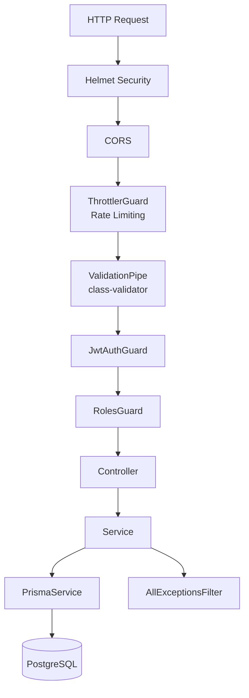
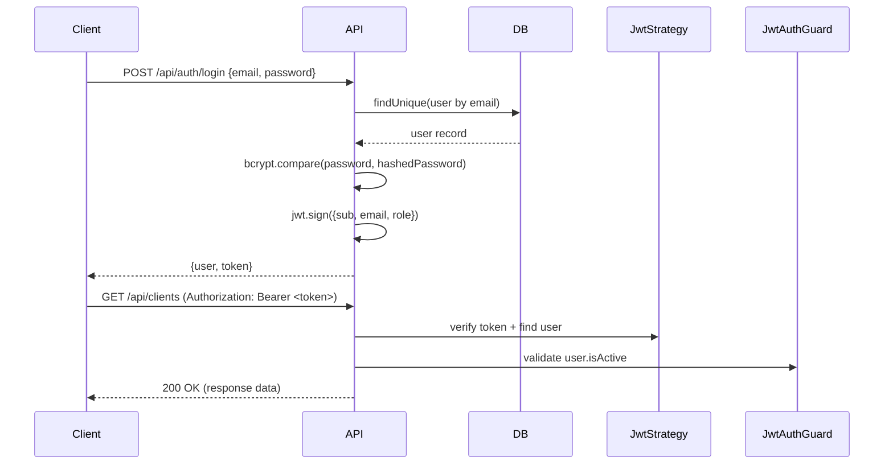

# VetClinic Pro — API Backend

Backend REST API construido con NestJS, TypeScript y Prisma ORM para el sistema de gestión veterinaria.

## Arquitectura del API



La API sigue el patrón **Controller → Service → Prisma**, donde:
- **Controllers** manejan las peticiones HTTP y validación de entrada
- **Services** contienen la lógica de negocio (con transacciones para operaciones críticas)
- **PrismaService** abstrae el acceso a la base de datos
- **AllExceptionsFilter** mapea errores Prisma a respuestas HTTP consistentes

### Punto de entrada

`apps/api/src/main.ts:1-50` — Configura Helmet, CORS, ValidationPipe global, AllExceptionsFilter y prefijo global `api`. Swagger solo disponible en `NODE_ENV !== 'production'`.

## Módulos

| Módulo | Archivos | Descripción |
|---|---|---|
| **Auth** | `modules/auth/` | Login, registro (solo ADMIN), perfil. JWT + bcrypt + Passport |
| **Users** | `modules/users/` | CRUD de usuarios. Solo ADMIN para listar/obtener |
| **Clients** | `modules/clients/` | CRM de dueños de mascotas |
| **Pets** | `modules/pets/` | CRUD mascotas, historial de peso (transacción), vacunas |
| **Appointments** | `modules/appointments/` | Agenda, calendario (sin paginación), filtros por doctor/fecha/estado |
| **Medical Records** | `modules/medical-records/` | Expedientes clínicos con formato SOAP |
| **Inventory** | `modules/inventory/` | Productos, categorías, control de stock |
| **Sales** | `modules/sales/` | Punto de venta con transacciones, tickets PDF, resumen diario |
| **Uploads** | `modules/uploads/` | Archivos adjuntos con protección path traversal y MIME |
| **Notifications** | `modules/notifications/` | WebSocket Gateway con JWT verification |
| **Common** | `modules/common/` | Guards, decoradores, filtros, DTOs compartidos |

### Estructura de un módulo (ejemplo: Clients)

```
modules/clients/
├── dto/
│   └── clients.dto.ts       # CreateClientDto, UpdateClientDto
├── __tests__/
│   └── clients.controller.spec.ts  # Integration tests
├── clients.controller.ts    # Rutas HTTP
├── clients.service.ts       # Lógica de negocio
└── clients.module.ts        # Configuración del módulo
```

## Autenticación (JWT)

El flujo de autenticación utiliza JSON Web Tokens con Passport.js.



- **Secret**: Configurado en `JWT_SECRET` (128 caracteres hex recomendado)
- **Expiración**: Configurado en `JWT_EXPIRES_IN` (default: 7 días)
- **Payload**: `{ sub: userId, email, role }`
- **Estrategia**: `apps/api/src/modules/auth/strategies/jwt.strategy.ts:14-42`

### Endpoint de Registro

`POST /auth/register` requiere `JwtAuthGuard` + `RolesGuard` con rol `ADMIN`. Solo administradores pueden crear nuevos usuarios.

## Control de Acceso Basado en Roles

Los roles están definidos en Prisma como enum `Role`:

```prisma
enum Role {
  ADMIN
  VETERINARIAN
  RECEPTIONIST
  INVENTORY_MANAGER
}
```

### Permisos por módulo

| Endpoint | ADMIN | VETERINARIAN | RECEPTIONIST | INVENTORY_MANAGER |
|---|---|---|---|---|
| Auth register | ✅ | ❌ | ❌ | ❌ |
| Auth login | ✅ | ✅ | ✅ | ✅ |
| Users CRUD | ✅ | ❌ | ❌ | ❌ |
| Users veterinarians | ✅ | ✅ | ✅ | ✅ |
| Clients create/update | ✅ | ❌ | ✅ | ❌ |
| Clients delete | ✅ | ❌ | ❌ | ❌ |
| Pets create/update | ✅ | ✅ | ✅ | ❌ |
| Pets weight/vaccination | ✅ | ✅ | ❌ | ❌ |
| Appointments CRUD | ✅ | ✅ | ✅ | ❌ |
| Medical Records CRUD | ✅ | ✅ | ❌ | ❌ |
| Inventory create/update/delete | ✅ | ❌ | ❌ | ✅ |
| Inventory categories | ✅ | ❌ | ❌ | ✅ |
| Sales create | ✅ | ✅ | ✅ | ✅ |
| Sales cancel | ✅ | ❌ | ❌ | ❌ |
| Uploads | ✅ | ✅ | ✅ | ✅ |

La implementación está en:
- **JwtAuthGuard**: `apps/api/src/modules/common/guards/jwt-auth.guard.ts`
- **RolesGuard**: `apps/api/src/modules/common/guards/roles.guard.ts:8-28`
- **Roles Decorator**: `apps/api/src/modules/common/decorators/roles.decorator.ts:1-5`

## Endpoints del API

Todos los endpoints tienen el prefijo `/api` configurado en `apps/api/src/main.ts:28`.

### Auth (`/api/auth`)

| Método | Ruta | Auth | Roles | Descripción |
|---|---|---|---|---|
| POST | `/auth/login` | No | - | Iniciar sesión |
| POST | `/auth/register` | Sí | ADMIN | Registrar usuario |
| GET | `/auth/profile` | Sí | Todos | Perfil del usuario actual |

### Users (`/api/users`)

| Método | Ruta | Auth | Roles | Descripción |
|---|---|---|---|---|
| GET | `/users` | Sí | ADMIN | Listar usuarios (paginado) |
| GET | `/users/veterinarians` | Sí | Todos | Listar veterinarios |
| GET | `/users/:id` | Sí | ADMIN | Obtener usuario por ID |
| POST | `/users` | Sí | ADMIN | Crear usuario |
| PATCH | `/users/:id` | Sí | ADMIN | Actualizar usuario |
| DELETE | `/users/:id` | Sí | ADMIN | Desactivar usuario |

### Clients (`/api/clients`)

| Método | Ruta | Auth | Roles | Descripción |
|---|---|---|---|---|
| GET | `/clients` | Sí | Todos | Listar clientes (paginado, búsqueda) |
| GET | `/clients/:id` | Sí | Todos | Obtener cliente con mascotas |
| POST | `/clients` | Sí | ADMIN, RECEPTIONIST | Crear cliente |
| PATCH | `/clients/:id` | Sí | ADMIN, RECEPTIONIST | Actualizar cliente |
| DELETE | `/clients/:id` | Sí | ADMIN | Desactivar cliente |

### Pets (`/api/pets`)

| Método | Ruta | Auth | Roles | Descripción |
|---|---|---|---|---|
| GET | `/pets` | Sí | Todos | Listar mascotas (paginado, filtros) |
| GET | `/pets/:id` | Sí | Todos | Obtener mascota con historial |
| POST | `/pets/client/:clientId` | Sí | ADMIN, VET, RECEPTIONIST | Crear mascota |
| PATCH | `/pets/:id` | Sí | ADMIN, VET, RECEPTIONIST | Actualizar mascota |
| POST | `/pets/:id/weight` | Sí | ADMIN, VETERINARIAN | Registrar peso (transacción) |
| GET | `/pets/:id/vaccinations` | Sí | Todos | Historial de vacunas |
| POST | `/pets/:id/vaccinations` | Sí | ADMIN, VETERINARIAN | Registrar vacuna |
| DELETE | `/pets/:id` | Sí | ADMIN | Desactivar mascota |

### Appointments (`/api/appointments`)

| Método | Ruta | Auth | Roles | Descripción |
|---|---|---|---|---|
| GET | `/appointments` | Sí | Todos | Listar citas (paginado, filtros) |
| GET | `/appointments/calendar` | Sí | Todos | Citas para vista de calendario (sin paginación) |
| GET | `/appointments/:id` | Sí | Todos | Obtener cita por ID |
| POST | `/appointments` | Sí | ADMIN, VET, RECEPTIONIST | Crear cita |
| PATCH | `/appointments/:id` | Sí | ADMIN, VET, RECEPTIONIST | Actualizar cita |
| DELETE | `/appointments/:id` | Sí | ADMIN, VET, RECEPTIONIST | Cancelar cita |

> **Nota**: `GET /appointments/calendar` retorna `Appointment[]` directamente (sin paginación) para renderizado del calendario.

### Medical Records (`/api/medical-records`)

| Método | Ruta | Auth | Roles | Descripción |
|---|---|---|---|---|
| GET | `/medical-records/pet/:petId` | Sí | Todos | Expedientes de una mascota |
| GET | `/medical-records/:id` | Sí | Todos | Obtener expediente por ID |
| POST | `/medical-records` | Sí | ADMIN, VETERINARIAN | Crear expediente (SOAP) |
| PATCH | `/medical-records/:id` | Sí | ADMIN, VETERINARIAN | Actualizar expediente |

### Inventory (`/api/inventory`)

| Método | Ruta | Auth | Roles | Descripción |
|---|---|---|---|---|
| GET | `/inventory` | Sí | Todos | Listar productos (paginado) |
| GET | `/inventory/low-stock` | Sí | Todos | Alertas de stock bajo |
| GET | `/inventory/expiring` | Sí | Todos | Productos por caducar |
| GET | `/inventory/categories` | Sí | Todos | Listar categorías |
| GET | `/inventory/:id` | Sí | Todos | Obtener producto por ID |
| POST | `/inventory` | Sí | ADMIN, INV_MANAGER | Crear producto |
| POST | `/inventory/categories` | Sí | ADMIN, INV_MANAGER | Crear categoría |
| PATCH | `/inventory/:id` | Sí | ADMIN, INV_MANAGER | Actualizar producto |
| PATCH | `/inventory/:id/adjust-stock` | Sí | ADMIN, INV_MANAGER | Ajustar stock |
| DELETE | `/inventory/:id` | Sí | ADMIN, INV_MANAGER | Eliminar producto |

### Sales (`/api/sales`)

| Método | Ruta | Auth | Roles | Descripción |
|---|---|---|---|---|
| GET | `/sales` | Sí | Todos | Listar ventas (paginado, por fecha) |
| GET | `/sales/daily-summary` | Sí | Todos | Resumen de ventas diarias |
| GET | `/sales/:id` | Sí | Todos | Obtener venta por ID |
| GET | `/sales/:id/receipt` | Sí | Todos | Generar ticket PDF |
| POST | `/sales` | Sí | Todos | Crear venta (transacción) |
| PATCH | `/sales/:id/cancel` | Sí | ADMIN | Cancelar venta (transacción) |

### Uploads (`/api/uploads`)

| Método | Ruta | Auth | Roles | Descripción |
|---|---|---|---|---|
| POST | `/uploads/medical-record/:recordId` | Sí | Todos | Subir archivo a expediente |
| GET | `/uploads/medical-records/:filename` | Sí | Todos | Obtener archivo adjunto |

## Validación de DTOs

Se utiliza `class-validator` con `ValidationPipe` global configurado en `apps/api/src/main.ts:18-24`:

```typescript
app.useGlobalPipes(
  new ValidationPipe({
    whitelist: true,           // Elimina propiedades no definidas en el DTO
    forbidNonWhitelisted: true, // Rechaza requests con propiedades desconocidas
    transform: true,           // Transforma tipos automáticamente
  }),
);
```

### DTOs del sistema

| DTO | Ubicación | Campos |
|---|---|---|
| `LoginDto` | `modules/auth/dto/auth.dto.ts` | email, password |
| `RegisterDto` | `modules/auth/dto/auth.dto.ts` | email, password, firstName, lastName, role, specialty?, licenseNumber? |
| `CreateClientDto` | `modules/clients/dto/clients.dto.ts` | firstName, lastName, email?, phone, address?, rfc? |
| `UpdateClientDto` | `modules/clients/dto/clients.dto.ts` | Todos opcionales |
| `CreatePetDto` | `modules/pets/dto/pets.dto.ts` | name, species, breed?, dateOfBirth?, gender?, color?, weight?, microchip?, notes? |
| `AddWeightDto` | `modules/pets/dto/pets.dto.ts` | weight, notes? |
| `AddVaccinationDto` | `modules/pets/dto/pets.dto.ts` | vaccineName, batch?, applicationDate, nextDueDate?, veterinarian?, notes? |
| `CreateAppointmentDto` | `modules/appointments/dto/appointments.dto.ts` | petId, doctorId, dateTime, duration, type, notes? |
| `UpdateAppointmentDto` | `modules/appointments/dto/appointments.dto.ts` | Todos opcionales |
| `CreateMedicalRecordDto` | `modules/medical-records/dto/medical-records.dto.ts` | petId, appointmentId?, subjective?, objective?, assessment?, plan?, diagnosis?, treatment? |
| `CreateProductDto` | `modules/inventory/dto/inventory.dto.ts` | name, sku, description?, price, cost?, stock, minStock, categoryId, expiryDate?, batch? |
| `AdjustStockDto` | `modules/inventory/dto/inventory.dto.ts` | quantity, reason |
| `CreateCategoryDto` | `modules/inventory/dto/inventory.dto.ts` | name, type |
| `CreateSaleDto` | `modules/sales/dto/sales.dto.ts` | clientId?, paymentMethod?, items[{productId, quantity}] |
| `PaginationDto` | `modules/common/dto/pagination.dto.ts` | page, limit, search?, startDate?, endDate?, doctorId?, status? |

## Manejo de Errores

`AllExceptionsFilter` en `apps/api/src/modules/common/filters/http-exception.filter.ts:6-92` intercepta todas las excepciones y mapea errores Prisma a respuestas HTTP consistentes.

### Formato de respuesta de error

```json
{
  "statusCode": 409,
  "error": "Conflict",
  "message": ["Ya existe un registro con ese email"],
  "timestamp": "2024-01-15T10:30:00.000Z"
}
```

### Códigos de error de Prisma manejados

| Código Prisma | HTTP Status | Mensaje | Causa común |
|---|---|---|---|
| `P2002` | 409 Conflict | `Ya existe un registro con ese {fields}` | Email duplicado, SKU duplicado |
| `P2025` | 404 Not Found | `Registro no encontrado` | Registro no existe al actualizar/eliminar |
| `P2003` | 400 Bad Request | `Referencia inválida: el registro relacionado no existe` | FK inválida al crear |
| `P2014` | 400 Bad Request | `La operación violaría una relación requerida` | Violación de relación requerida |
| `P2021` | 500 Internal | `Error de esquema en la base de datos` | Tabla no existe |
| `P2022` | 500 Internal | `Columna no encontrada en la base de datos` | Columna no existe |
| Default | 500 Internal | `Error interno de base de datos` | Otros errores Prisma |

## Testing

### Comandos

```bash
cd apps/api
pnpm test              # Ejecutar todos los tests
pnpm test:watch        # Modo watch
pnpm test:coverage     # Con reporte de cobertura
```

### Tests Unitarios

Ubicación: `apps/api/src/__tests__/unit/`

| Archivo | Módulo | Cobertura |
|---|---|---|
| `auth.service.test.ts` | AuthService | Login (credenciales válidas/inválidas, usuario desactivado), registro (hash de password, email duplicado), perfil |
| `auth.controller.test.ts` | AuthController | Guards metadata, roles |
| `clients.service.test.ts` | ClientsService | CRUD, búsqueda, paginación |
| `users.service.test.ts` | UsersService | CRUD, roles, desactivación |
| `inventory.service.test.ts` | InventoryService | CRUD, stock bajo, productos por caducar |
| `medical-records.service.test.ts` | MedicalRecordsService | CRUD, formato SOAP |
| `sales.service.test.ts` | SalesService | CRUD, transacciones, resumen diario |
| `appointments.service.test.ts` | AppointmentsService | CRUD, filtros, calendario |
| `dto.validation.test.ts` | DTOs | Validación de todos los DTOs |

### Tests de Integración

Ubicación: `apps/api/src/modules/<module>/__tests__/`

| Archivo | Módulo | Cobertura |
|---|---|---|
| `auth.controller.spec.ts` | Auth | Endpoints login/register/profile, guards metadata |
| `clients.controller.spec.ts` | Clients | CRUD, búsqueda, paginación, errores |
| `pets.controller.spec.ts` | Pets | CRUD, peso, vacunas, filtros |

### Tests de Servicio (spec.ts)

| Archivo | Módulo | Cobertura |
|---|---|---|
| `auth.service.spec.ts` | Auth | Login, registro, perfil, mocking Prisma + JWT |
| `pets.service.spec.ts` | Pets | CRUD, addWeight (transacción), vacunas |
| `sales.service.spec.ts` | Sales | CRUD, create (transacción), cancel (transacción) |

## Eventos WebSocket

El gateway de notificaciones está en `apps/api/src/modules/notifications/notification.gateway.ts:20-107`.

Namespace: `/notifications`

### Conexión

Los clientes se autentican enviando el token JWT en el handshake:

```typescript
const socket = io('http://localhost:4000/notifications', {
  auth: { token: '<jwt-token>' },
});
```

El gateway verifica el token al conectar (`notification.gateway.ts:28-44`). Si no es válido, desconecta al cliente. CORS se configura desde `process.env.CORS_ORIGINS`.

### Salas (Rooms)

Los clientes pueden unirse a salas para recibir eventos específicos:

| Sala | Eventos |
|---|---|
| `appointments` | `appointment:created`, `appointment:updated`, `appointment:deleted` |
| `inventory` | `stock:low` |
| `sales` | `sale:created` |
| `medical-records` | `record:created` |
| `clients` | `vaccination:reminder` |

### Eventos del cliente al servidor

| Evento | Descripción |
|---|---|
| `join:room` | Unirse a una sala. Salas permitidas: appointments, sales, inventory, medical-records, clients |
| `leave:room` | Salir de una sala |

### Eventos del servidor al cliente

| Evento | Sala | Payload | Descripción |
|---|---|---|---|
| `appointment:created` | appointments | Appointment | Nueva cita creada |
| `appointment:updated` | appointments | Appointment | Cita actualizada |
| `appointment:deleted` | appointments | `{ id: string }` | Cita cancelada |
| `stock:low` | inventory | Product | Producto con stock bajo |
| `vaccination:reminder` | clients | `{ pet, vaccination }` | Recordatorio de vacuna |
| `sale:created` | sales | Sale | Nueva venta registrada |
| `record:created` | medical-records | MedicalRecord | Nuevo expediente médico |

## Subida de Archivos

`apps/api/src/modules/uploads/uploads.controller.ts:34-136`

- **Tamaño máximo**: 5 MB
- **Tipos permitidos**: .jpg, .jpeg, .png, .gif, .webp, .pdf
- **MIME types permitidos**: image/jpeg, image/png, image/gif, image/webp, application/pdf
- **Almacenamiento**: `uploads/medical-records/`
- **Protección**: Path traversal validation en `uploads.controller.ts:110-119` (rechaza `..`, `/`, `\`)
- **MIME validation**: `uploads.controller.ts:66-68` (doble verificación de extensión y MIME)

Los archivos se nombran con UUID para evitar colisiones: `{uuid}.{ext}`.

## Seguridad

### Rate Limiting

`ThrottlerGuard` aplicado globalmente via `APP_GUARD` en `apps/api/src/app.module.ts:53-57`:

| Nombre | Ventana | Límite |
|---|---|---|
| `short` | 1 segundo | 10 requests |
| `medium` | 10 segundos | 50 requests |
| `long` | 60 segundos | 100 requests |

### Helmet

Helmet habilitado en `main.ts:11` para headers de seguridad (CSP, HSTS, X-Frame-Options, etc.).

### CORS

CORS configurable via `CORS_ORIGINS` env var (comma-separated). Default: `http://localhost:3000,http://127.0.0.1:3000`.

### Swagger

Swagger/OpenAPI solo disponible en entornos no productivos (`main.ts:30-40`).

- **URL**: http://localhost:4000/docs
- **Tags**: Auth, Users, Clients, Pets, Appointments, Medical Records, Inventory, Sales, Uploads
