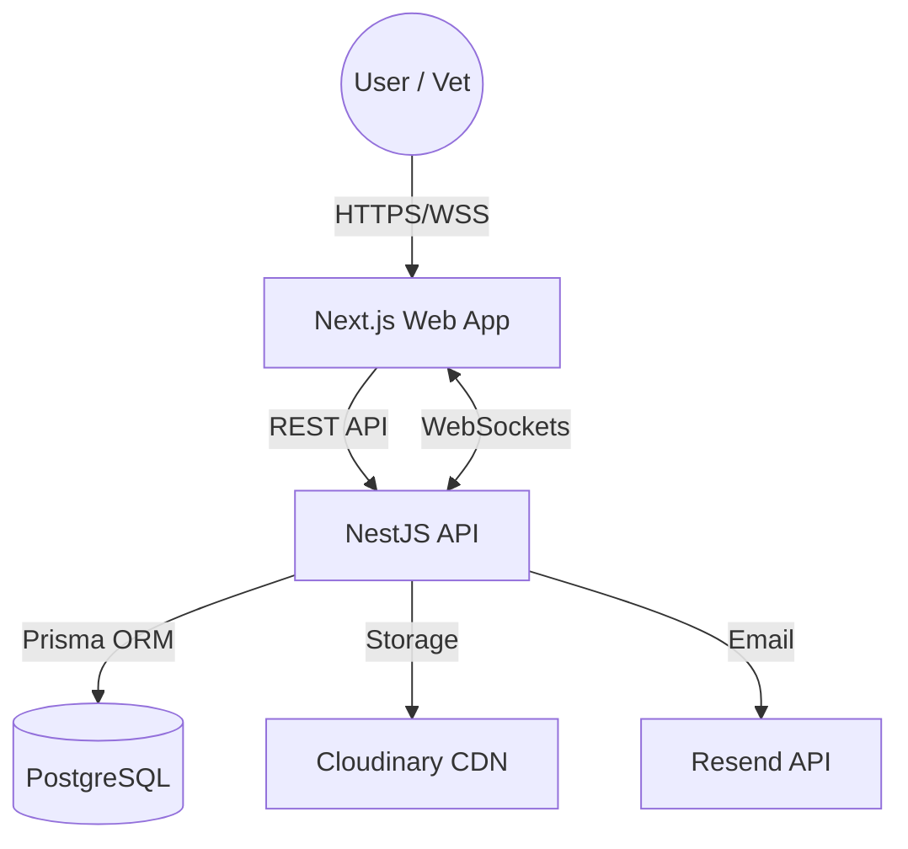

# System Architecture: VetClinic Pro

VetClinic Pro is a specialized B2B SaaS platform for veterinary clinic management. It utilizes a modern, decoupled architecture designed for scalability, real-time updates, and a high-fidelity user experience.

## 🏗️ High-Level Overview

The application is structured as a monorepo containing two primary applications and shared configurations.



## 🛠️ Technology Stack

### Core
- **Monorepo Manager**: `pnpm`
- **Language**: TypeScript (Strict mode)
- **Database**: PostgreSQL
- **ORM**: Prisma

### Backend (apps/api)
- **Framework**: NestJS (Node.js)
- **Security**: Passport.js (JWT), Helmet, Throttler (Rate Limiting)
- **Real-time**: Socket.io
- **Validation**: class-validator, class-transformer
- **Documentation**: Swagger/OpenAPI (In development)
- **File Uploads**: Multer + Cloudinary

### Frontend (apps/web)
- **Framework**: Next.js 14 (App Router)
- **Styling**: Tailwind CSS + shadcn/ui
- **State Management**: TanStack Query (v5)
- **Forms**: React Hook Form + Zod
- **Animations**: Framer Motion
- **Real-time**: Socket.io-client
- **Charts**: Recharts
- **Calendar**: React Big Calendar

## 📁 Repository Structure

```text
vetclinic/
├── apps/
│   ├── api/                # NestJS Backend
│   │   ├── src/
│   │   │   ├── modules/    # Domain-driven feature modules
│   │   │   ├── common/     # Shared guards, decorators, filters
│   │   │   └── database/   # Prisma service integration
│   └── web/                # Next.js Frontend
│       ├── src/
│       │   ├── app/        # Next.js App Router (Pages & Layouts)
│       │   ├── components/ # Atomic UI components (shadcn/ui)
│       │   ├── hooks/      # Custom React & TanStack Query hooks
│       │   └── lib/        # API clients and utilities
├── prisma/                 # Shared database schema and seed scripts
├── docs/                   # System documentation
└── package.json            # Workspace configuration
```

## 🔄 Real-time Communication

Real-time updates are handled via **Socket.io**. The backend emits events when critical data changes, and the frontend listens to these events to invalidate TanStack Query caches or show toast notifications.

**Key Events:**
- `appointment:created` / `appointment:updated`: Updates the calendar and dashboard.
- `stock:low`: Triggers alerts for inventory managers.
- `sale:created`: Updates financial dashboards.

## 🔐 Security Architecture

1. **Authentication**: JWT-based authentication with Refresh Token rotation.
2. **Authorization**: Role-Based Access Control (RBAC) using NestJS Guards (`ADMIN`, `VETERINARIAN`, `RECEPTIONIST`, `INVENTORY_MANAGER`).
3. **Data Integrity**: Enforced via Prisma schema constraints and NestJS `ValidationPipe`.
4. **Security Headers**: Implemented via `helmet` in the backend and Next.js security configurations in the frontend.
