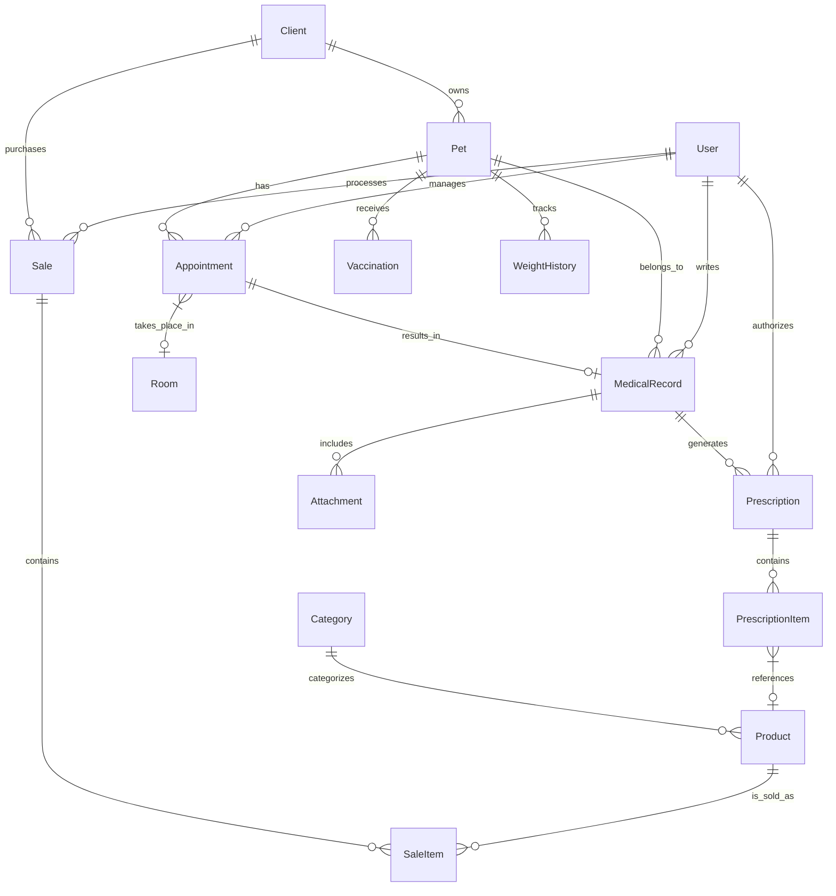

# Database Documentation: VetClinic Pro

VetClinic Pro uses **PostgreSQL** as its primary data store, managed through **Prisma ORM**. The schema is designed for high relational integrity and performance with extensive use of indexes and clear naming conventions.

## 📊 Entity Relationship Diagram

## 📝 Model Descriptions

### Core Identity
- **User**: Clinic staff (Admins, Vets, Receptionists). Stores credentials, role, and professional details (license, specialty).
- **Client**: Pet owners. Stores contact info and billing details (RFC).
- **Pet**: Animal patients. Stores species, breed, and bio-data.

### Clinical Workflow
- **Appointment**: Scheduled visits. Tracks date, duration, status, and room assignment.
- **MedicalRecord**: SOAP notes (Subjective, Objective, Assessment, Plan). Linked to a specific appointment and pet.
- **Vaccination**: Records of immunizations with future due date tracking.
- **Prescription**: Medication orders authorized by a veterinarian.
- **WeightHistory**: Historical tracking of animal weight for health monitoring.

### Inventory & Sales
- **Product**: Goods and services. Tracks SKU, stock levels, cost, and pricing.
- **Category**: Product classifications (e.g., Medicine, Food, Service).
- **Sale**: Transaction header. Tracks totals, payment method, and client.
- **SaleItem**: Individual lines within a sale.

### System
- **RefreshToken**: Used for JWT session management.
- **BlacklistedToken**: Stores revoked tokens for logout security.
- **NotificationLog**: Tracks outgoing communications (Email/SMS/WhatsApp).

## 🛠️ Key Schema Features

1. **Soft Deletes**: Most core entities use an `isActive` boolean field to preserve historical data.
2. **Indexing**: Strategic indexes on `email`, `phone`, `status`, and foreign keys ensure fast lookups.
3. **Auditability**: `createdAt` and `updatedAt` timestamps are standard on all models.
4. **Precision**: `Decimal` type used for all financial fields (`subtotal`, `tax`, `total`, `price`) to avoid floating-point errors.
5. **PostgreSQL Enums**: Used for fixed sets of values like `Role`, `AppointmentType`, and `StockStatus`.

## 🚀 Commands

- **Generate Client**: `pnpm db:generate`
- **Push Changes**: `pnpm db:push`
- **Create Migration**: `pnpm db:migrate`
- **Seed Data**: `pnpm db:seed`
