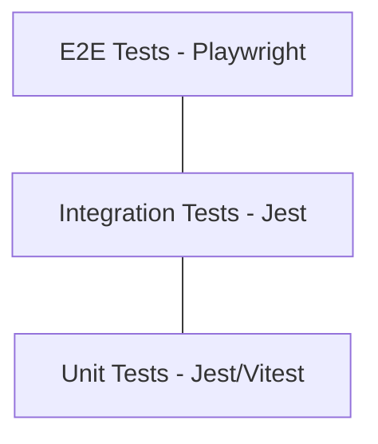

# Testing Strategy: VetClinic Pro

Documentation of the testing strategy, tools, and methodologies used in VetClinic Pro.

## 🧪 Testing Pyramid

We follow a balanced testing pyramid to ensure reliability at all levels of the application.



## 🛠️ Tooling

### Backend (NestJS)
- **Framework**: [Jest](https://jestjs.io/)
- **Integration**: `supertest` for API endpoint testing.
- **Mocking**: `jest-mock-extended` for Prisma and external services.

### Frontend (Next.js)
- **Framework**: [Vitest](https://vitest.dev/)
- **Component Testing**: [React Testing Library](https://testing-library.com/docs/react-testing-library/intro/)
- **E2E**: [Playwright](https://playwright.dev/) (Planned)

---

## 🏗️ Backend Testing Patterns

### 1. Unit Tests
Focus on business logic within services.
- **Location**: `apps/api/src/modules/<module>/*.service.spec.ts`
- **Goal**: 100% coverage of clinical calculation logic and status transitions.

### 2. Integration Tests
Focus on the interaction between Controllers, Services, and the Database.
- **Location**: `apps/api/test/*.e2e-spec.ts`
- **Database**: Uses a dedicated PostgreSQL test container or a separate test schema.

## 🏗️ Frontend Testing Patterns

### 1. Component Tests
Focus on UI behavior and accessibility.
- **Location**: `apps/web/src/components/**/*.test.tsx`
- **Patterns**: Mocking TanStack Query hooks and testing user interactions (clicks, form inputs).

### 2. Hooks Testing
Testing custom logic abstracted into hooks.
- **Location**: `apps/web/src/hooks/*.test.ts`

---

## 🚀 Running Tests

### Backend
```bash
cd apps/api
pnpm test          # Run all tests
pnpm test:watch    # Watch mode
pnpm test:coverage # Generate coverage report
```

### Frontend
```bash
cd apps/web
pnpm test          # Run Vitest
```

---

## 📝 Implementation Guidelines

1. **AAA Pattern**: Arrange, Act, Assert.
2. **Deterministic Data**: Use factories (like `faker.js`) to generate unique test data.
3. **No Side Effects**: Tests must be isolated and clean up their own state.
4. **Prisma Mocking**: Use the provided `PrismaService` mock to avoid hitting the DB in unit tests.
